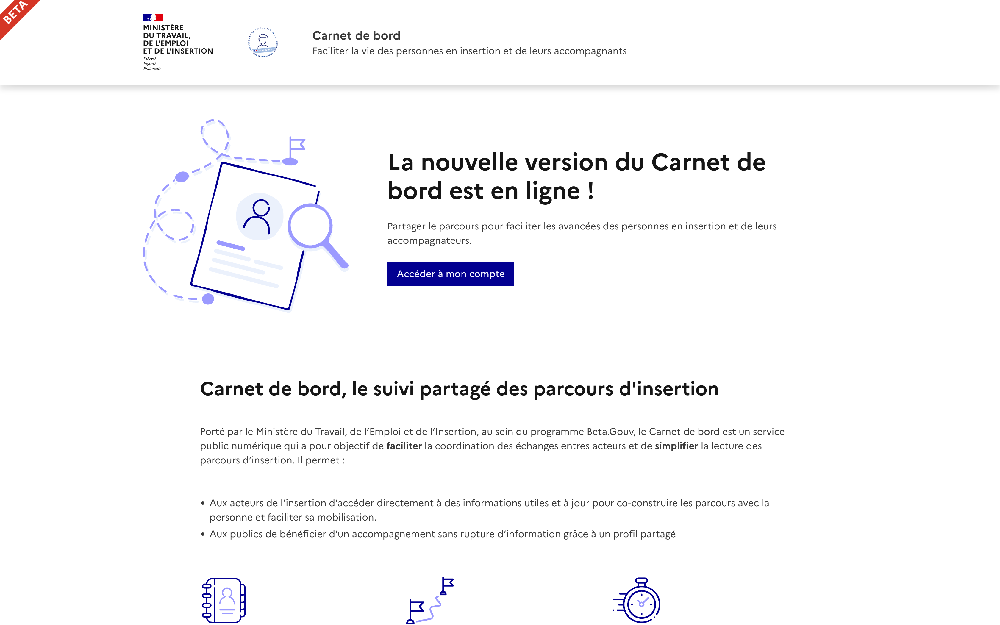
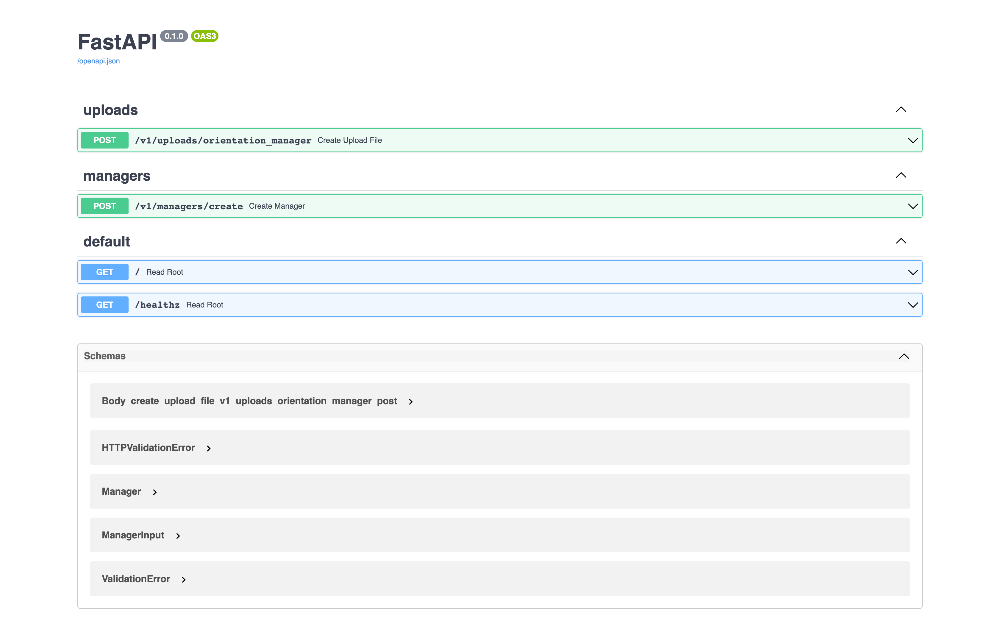
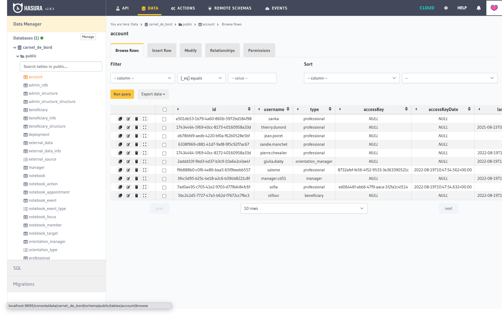

# Guide d'installation

## Prérequis

Vous devez au préalable avoir correctement installé les logiciels suivants :

- docker (version 20.10.5)
- docker-compose (version 1.29.0)
- node (version 18)
- hasura-cli (latest)
- pre-commit https://pre-commit.com
- poetry (1.2)
- [make](https://www.gnu.org/software/make/)
  - Il vient souvent pré-installé et est disponible sur les gestionnaires de paquets

> ℹ️️ Les versions indiquées sont celles utilisées et préconisées par l'équipe de développement. Il est possible que l'application fonctionne avec des versions différentes.

> ⚠️ Assurez-vous que les ports **5000** (Hasura) et **5432** (PostgreSQL) soient libres d'écoute. Le cas échéant, vous pouvez changer les ports dans les fichiers de configuration ou d'environnement de l'application.

### ❄️ Nix et direnv (facultatif)

Une configuration nix est disponible via le fichier flake.nix.

En conjonction avec [direnv](https://direnv.net/), cette configuration vous permet d'installer les dépendances du projet de manière isolée. Les outils du projet ne seront disponibles que dans le dossier du projet, dans la bonne version.

Pour utiliser cette configuration :

1. Installer [nix](https://nixos.org/download.html) et [direnv](https://direnv.net/).
2. Aller dans le dossier racine du projet (avec un terminal)
3. Autoriser direnv à fonctionner dans le dossier

```bash
direnv allow
```

Pour vérifier l'installation

```bash
pre-commit --version # pre-commit X.X.X
poetry --version # Poetry (version X.X.X)
node --version # v18.X.X
```

## Étapes

**1/** Récupérer les sources du projet

```sh
git clone git@github.com:gip-inclusion/carnet-de-bord.git
cd carnet-de-bord
```

**2/** Lancer l'installation avec make

```sh
make install # copie les fichiers d'environnement et télécharge les dépendances
```

> ℹ️ Parmi les dépendances de développement du projet (cf. [package.json](./app/package.json)), on retrouve la CLI Hasura, utile pour l'étape #5.

**3/** Démarrer les composants tiers

L'application repose sur Hasura et PostgreSQL. Une [stack docker-compose](./docker-compose.yaml) est maintenue par l'équipe pour instancier et démarrer ces services.

```sh
docker compose up
```

**4/** Alimenter la base de données

Dans un second terminal :

```sh
make seed-database
```

ou

```sh
hasura --project ./hasura console
```

**5/** Compiler et démarrer l'application SvelteKit

Dans un troisième terminal :

```sh
make start:app # démarrer le serveur de développement SvelteKit
```

**6/** Configurer et démarrer l'API back-end métier

Dans un quatrième et dernier terminal

```sh
make start:backend # démarre l'instance de serveur FastAPI
```

**7/** Accéder aux applications & outils (cf. captures ci-dessous)

- Webapp SvelteKit → http://localhost:3000
- API FastAPI → http://localhost:8000/docs
- Console Hasura → http://localhost:9695

**8/** Accéder aux différents comptes de démonstration

L'équipe maintient des comptes de démo, renseignés dans le fichier [DEMO.md](./DEMO.md).

## Captures d'écran

**Page d'accueil** de [l'application SvelteKit](http://localhost:3000).



**Documentation Swagger** de [l'API FastAPI](http://localhost:8000/docs)



**Console Hasura** dont [l'instance](http://localhost:9695) est correctement alimentée en données (cf. onglet "Data") :


