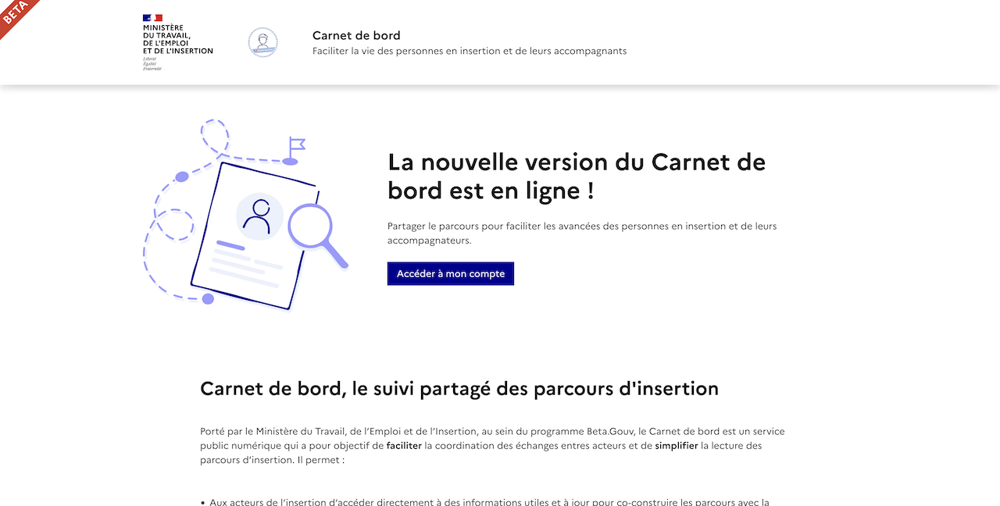
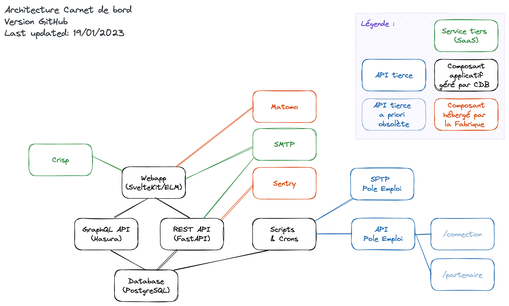

# Carnet de bord

[Carnet de bord](https://carnetdebord.inclusion.beta.gouv.fr/) est un service public dont l'objectif est de faciliter la coordination des échanges entre acteurs et simplifier la lecture des parcours d’insertion.

## Présentation

Le champ de l’insertion sociale et professionnelle, et en particulier le domaine de l’accompagnement des usagers, se caractérise par **une multiplicité et une grande diversité d’acteurs, d'outils et sources d'informations**. La mauvaise connaissance et l’absence de partage de certaines données ne permettent pas aux professionnels de procéder à une bonne évaluation des situations des usagers et un suivi optimal des parcours. Plus précisément, deux problématiques émergent :

1. L’impossibilité pour les accompagnateurs d’avoir une information claire sur les personnes ;
2. La difficulté pour les personnes à comprendre et à transmettre les informations sur leur parcours.

Développé dans le cadre du volet numérique du projet de [Service Public de l’Insertion et de l’Emploi](https://travail-emploi.gouv.fr/emploi-et-insertion/service-public-insertion-emploi-spie/article/le-service-public-de-l-insertion-et-de-l-emploi-spie-c-est-quoi), l’outil Carnet de bord est **un service public qui centralise les données essentielles du parcours en une seule page**. Il regroupe l’information dans un espace sécurisé permettant un échange accru des données essentielles, entre les accompagnateurs et le bénéficiaire afin d’amplifier la coordination et fluidifier le parcours d’un usager !

## Gouvernance

La plateforme est développée, maintenue et supervisée par l'équipe "Carnet de bord" issue de l'incubateur d'état [BetaGouv](https://beta.gouv.fr), au sein du [GIP de la Plateforme de l'inclusion](https://www.legifrance.gouv.fr/jorf/id/JORFTEXT000045614680), dont les principaux membres sont le Ministère du Travail, du Plein emploi et de l'Insertion et Pôle emploi.

La plateforme est hébergée et opérée en production par les équipes sur Scalingo (https://scalingo.com).

## Architecture

La plateforme Carnet de bord est constituée des briques applicatives suivantes :
- une application cliente SSR en TypeScript / **SvelteKit** et en **Elm** (front-end)
- une instance **Hasura** permettant au client de requêter la base en lecture + écriture (avec gestion des droits et scopes) via GraphQL (back-for-front)
- une base de données **PostgreSQL**
- une API métier en Python / **FastAPI** (back-end)

## Installation

Le guide d'installation de la plateforme peut être consulté depuis le fichier [INSTALL.md](./INSTALL.md).

## Développement

Le guide de développement de la plateforme peut être consulté depuis le fichier [DEVELOPING.md](./DEVELOPING.md).

## Déploiement

Le guide de déploiement en production de la plateforme peut être consulté depuis le fichier [DEPLOY.md](./DEPLOY.md).

## READMEs

En complément du présent fichier README, ce dépôt de code inclut d'autres READMEs détaillant les sous-répertoires qui les contiennent :
- [backend/README.md](./backend/README.md)
- [e2e/README.md](./e2e/README.md)

## Code de conduite

L'équipe respecte et applique un code de conduite adapté du [_Contributor Covenant_](https://www.contributor-covenant.org/), version 2.0.

Le code de conduite de l'équipe en charge du projet peut être consulté depuis le fichier [CODE_OF_CONDUCT.md](./CODE_OF_CONDUCT.md).

## Licence

Ce logiciel et son code source sont distribués sous licence Apache-2.0.

Le texte entier de la licence peut être consulté depuis le fichier [LICENSE](./LICENSE).
