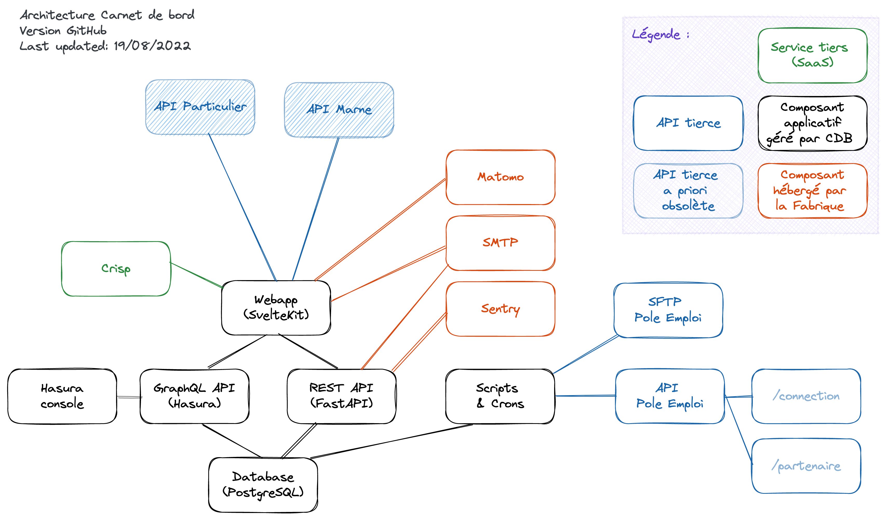

# Carnet de bord

[Carnet de bord](https://carnet-de-bord.fabrique.social.gouv.fr/) est un service public dont l'objectif est de faciliter la coordination des échanges entres acteurs et simplifier la lecture des parcours d’insertion.


## Présentation

Le champ de l’insertion sociale et professionnelle, et en particulier le domaine de l’accompagnement des usagers, se caractérise par **une multiplicité et une grande diversité d’acteurs, d'outils et sources d'informations**. La mauvaise connaissance et l’absence de partage de certaines données ne permettent pas aux professionnels de procéder à une bonne évaluation des situations des usagers et un suivi optimal des parcours. Plus précisément, deux problématiques émergent :

1. L’impossibilité pour les accompagnateurs d’avoir une information claire sur les personnes ;
2. La difficulté pour les personnes à comprendre et à transmettre les informations sur leur parcours.

Développé dans le cadre du volet numérique du projet de [Service Public de l’Insertion et de l’Emploi](https://travail-emploi.gouv.fr/emploi-et-insertion/service-public-insertion-emploi-spie/article/le-service-public-de-l-insertion-et-de-l-emploi-spie-c-est-quoi), l’outil Carnet de bord est **un service public qui centralise les données essentielles du parcours en une seule page**. Il regroupe l’information dans un espace sécurisé permettant un échange accru des données essentielles, entre les accompagnateurs et le bénéficiaire afin d’amplifier la coordination et fluidifier le parcours d’un usager !

## Gouvernance

La plateforme est développée, maintenue et supervisée par l'équipe "Carnet de bord" issue de l'incubateur d'état [BetaGouv](https://beta.gouv.fr), au sein du [GIP de la Plateforme de l'inclusion](https://www.legifrance.gouv.fr/jorf/id/JORFTEXT000045614680), dont les principaux membres sont le Ministère du Travail, du Plein emploi et de l'Insertion et Pôle emploi.

La plateforme est hébergée et opérée en production par les équipes et au sein de l'infrastructure de [la Fabrique numérique des Ministères Sociaux](https://www.fabrique.social.gouv.fr/).

## Architecture



La plateforme Carnet de bord est constituée des briques applicatives suivantes :
- une application cliente SSR en TypeScript / **SvelteKit** (front-end)
- une instance **Hasura** permettant au client de requêter la base en lecture + écriture (avec gestion des droits et scopes) via GraphQL (back-for-front)
- une base de données **PostgreSQL**
- une API métier en Python / **FastAPI** (back-end)

## Installation

Le guide d'installation de la plateforme peut être consulté depuis le fichier [INSTALL.md](./INSTALL.md).


## Développement

**Génération des types graphql**

on écrit un fichier `_query.gql` ou `_mutation.gql`

```gql
# _query.gql
query SearchBeneficiaries($filter: String) {
	beneficiary(
		where: {
			_or: [
				{ peNumber: { _ilike: $filter } }
				{ cafNumber: { _ilike: $filter } }
				{ lastname: { _ilike: $filter } }
				{ mobileNumber: { _ilike: $filter } }
			]
		}
	) {
		dateOfBirth
		firstname
		id
		lastname
		mobileNumber
	}
}
```

on génère les types avec `codegen`

```sh
yarn codegen
```

Les types graphql sont générés dans `src/_gen`. On peut alors les utiliser dans les composants

```ts
export const load: Load = async ({ page }) => {
	const filter = page.query.get('filter');
	const result = operationStore(SearchBeneficiariesDocument, {
		filter: `%${filter}%`,
	});

	return {
		props: {
			result,
			filter,
		},
	};
};
```

**Modification des metadata Hasura**

après avoir modifié des metadatas hasura dans la console (permissions, GraphQL field name, etc), ne pas oublier de les exporter

```sh
hasura metadata export
```

**Migration de la base de données**

Si les modifications du schéma de la base de données ont faites à partir de la console hasura `http://localhost:9695/`, hasura génère automatiquement des fichiers de migrations dans `hasura/migrations`.

avant de `merge` une PR, ne pas oublier de (squash)[https://hasura.io/docs/latest/graphql/core/hasura-cli/hasura_migrate_squash.html] les fichiers.

Les migrations sont appliquées automatiquement au lancement de hasura

```sh
docker-compose up --build
```

### Pratiques de l'équipe

Les modifications apportées au code doivent passer par des PR qui seront validées avant de pouvoir être versées dans la branche principale. On n'assigne pas forcément de relecteur, tout le monde est libre de relire la PR d'une autre personne.

Dans le cas où une personne de l'équipe de dev est seule, elle peut valider sa PR elle-même pour pouvoir avancer.

Lorsque la PR est validée, on laisse le soin à l'auteur de la PR de faire le merge.

L'équipe privilégie les "squash and merge" avec un message de commit qui suit le formalisme [conventional commit](https://www.conventionalcommits.org/en/v1.0.0-beta.2/) de manière à pouvoir générer le fichier [CHANGELOG.md](./CHANGELOG.md) automatiquement.

### Gestion des mails sur les environnement de developpements (review / preprod)

Pour les environnements de review les mail envoyés par l'application sont visible sur une instance de [maildev](https://maildev.github.io/maildev/) que l'on deploie lorsqu'on déploie nos environnement de review-branch.

Pour la preprod, nous utilisons [mailtrap](https://mailtrap.io) (demander l'accès)

### Howto

#### Exécuter un fichier de migration directement via postgres

```sh
docker-compose exec -T db psql --dbname carnet_de_bord --user cdb  < hasura/migrations/carnet_de_bord/${migration_name}/${up|down}.sql
```

#### Faire une requête GraphQL portant sur une absence de relation

Si la table `account` peut porter un `professional_id`, il n'est pas possible de faire la requête suivante, pourtant valide pour des propriétés "internes" :

```graphql
query GetProfessionalsNotLinkedFromAccount {
	professional_aggregate(where: { account: { _is_null: true } }) {
		aggregate {
			count
		}
	}
}
```

Il faut la formuler comme suit :

```graphql
query GetProfessionalsNotLinkedFromAccount {
	professional_aggregate(where: { _not: { account: {} } }) {
		aggregate {
			count
		}
	}
}
```

## READMEs

En complément du présent fichier README, ce dépôt de code inclut d'autres READMEs relatifs au sous-répertoire qui les contient :
- [backend/README.md](./backend/README.md)
- [e2e/README.md](./e2e/README.md)

## Code de conduite

L'équipe respecte et applique un code de conduite adapté du [_Contributor Covenant_](https://www.contributor-covenant.org/), version 2.0.

Le code de conduite de l'équipe en charge du projet peut être consulté depuis le fichier [CODE_OF_CONDUCT.md](./CODE_OF_CONDUCT.md).

## Licence

Ce logiciel et son code source sont distribués sous licence Apache-2.0.

Le texte entier de la licence peut être consulté depuis le fichier [LICENSE](./LICENSE).
