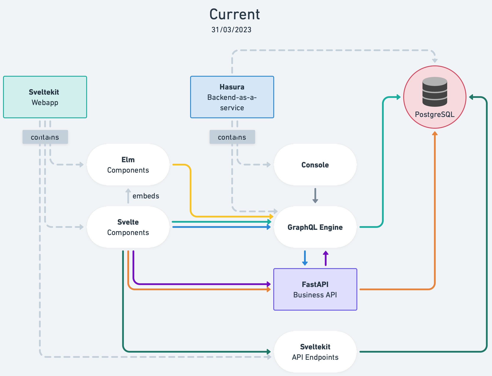
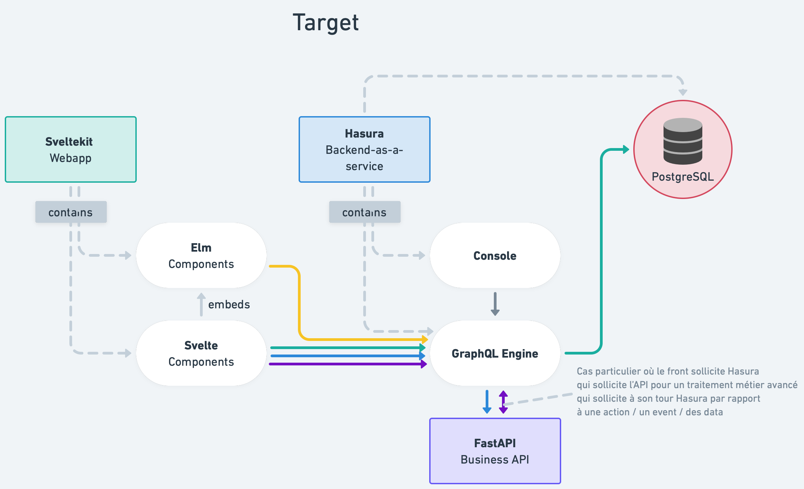

# Remettre Hasura au centre de l'architecture applicative de Carnet de bord 

## :memo: État

Accepté

## :stethoscope: Contexte

Historiquement, l’archi de Carnet de bord s’appuie sur Hasura, une brique open source qui permet de mettre en relation plusieurs systèmes (webapps, APIs, sources et bases de données).

Au fil du temps, une API métier a vu le jour, pour gérer certaines tâches « avancées » telles que : l’import /export de données via des imports fichiers, certaines requêtes SQL et traitement métiers complexes.

Cette brique back-end ajoute des endpoints REST à un back-for-front intégré à la webapp principale (en Sveltekit). Dans le passé, l’équipe avait pris la décision de migrer les endpoints Sveltekit vers l’API Python.

Aujourd’hui – malgré l'ADR ["Quand utiliser GraphQL ou l'API backend ?"](./20220926.utilisation-graphql-ou-backend.md)  – l’équipe se sent perdue au moment d’implémenter des features. Est-ce qu’il faut les mettre dans l’API Python ou les déclarer dans Hasura ? On sent une entropie des opposés qui nous fait craindre pour l’évolution et la capacité à faire vivre et évoluer l’archi.

Le schéma ci-dessus permet de visualiser la multitude de types de flux (GraphQL, REST) ou d'interconnexions au sein du système.

## :bulb: Pistes

1. Miser sur Hasura et remettre la brique au centre de l’archi (comme le veut la philosophie prônée par le produit), en suivant un maximum ses préceptes / guidelines / contraintes
2. Sortir Hasura et miser sur l’API Python
3. Réécrire le back-end from scratch, en Django (enfin, une techno un peu complète, qui permette de refondre rapidement)

## :sparkles: Décision

Nous prenons la décision de retenir la solution 1 et miser sur Hasura.

Les arguments qui nous ont décidés (par rapport à la solution 2, la 3 nous paraissent totalement irréaliste compte tenu de l’historique et la situation actuelle de CDB) :
- il y aurait plus d’une centaine de endpoints correspondant à la centaine de fichiers GraphQL à réécrire
- il faudrait reprendre et recoder de 0 le mécanisme de permission
- il faudrait coder tout plein d’opérations CRUD (pas passionnant, pas si simple, pas rapide du tout)

Nous pensons que si elle est bien utilisée, en respectant scrupuleusement ses standards et guidelines, la brique Hasura peut permettre à CDB de continuer de bien se développer, pour les usagers / utilisateurs ainsi que les devs / le projet.

## Conséquences

Nous pensons qu'un tel choix va sensiblement simplifier l'architecture et faciliter le développement, l'évolution et le passage à l'échelle de la plateforme.

Nous devons viser à couper les liens webapp -> API et API -> BDD.

Au passage, nous devons planifier et mettre en œuvre la conversion des 9 derniers endpoints Sveltekit restant vers (des actions) Hasura.

Nous pouvons conserver en l’état l’API Python / FastAPI (12 endpoints). Nous devons cependant veiller à ce qu’elle respecte le format et les bonnes pratiques Hasura.

Nous devons modifier les requêtes SQL en requêtes GraphQL via Hasura (et déclarer les actions / endpoints qui vont bien).

La cible est que l'accès direct du serveur Python à la base de données PostgreSQL ne soit plus nécessaire. Si des opérations doivent être effectuées qui seraient difficiles à exprimer de façon efficace en GraphQL "pur", les possibilités suivantes devraient permettre de les faire passer quand même par l'API Hasura :
- la définition de fonctions et routines PL/SQL appelables via des mutations GraphQL ;
- l'API Hasura "Run SQL" qui permet d'exécuter des commandes SQL arbitraires : https://hasura.io/docs/latest/api-reference/schema-api/run-sql/
Afin d'accélérer la migration vers ce mode d'accès aux données passant entièrement par Hasura, on peut envisager de remplacer dans un premier temps tous les accès SQL faits dans le code Python par des appels à cette API "Run SQL", sachant qu'il est possible que cela se heurte à certaines contraintes notamment au niveau de la gestion des transactions.

Nous devons nous assurer que l’API Python ne soit jamais accessible sur Internet, autre que par Hasura.

Pour les tâches planifiées (_cron_), nous généraliserons l'utilisation du _scheduler_ Hasura (https://hasura.io/docs/latest/scheduled-triggers/create-cron-trigger/), déjà utilisé pour l'envoi de rapports quotidiens à Matomo, plutôt que par exemple le _scheduler_ Scalingo tel qu'il a été mis en place pour l'envoi automatique d'emails de relance (https://github.com/gip-inclusion/carnet-de-bord/pull/1454/files#diff-0459a8f0d0cb8e5dc97c651a02c11ed3dcc6eceac13ca748ea20b89717b17cee).

## Points de vigilance

Il s’est posé la question du passage à l’échelle.

Hasura est OSS mais propose un version payante pour des contextes de passage à l’échelle. Le pricing n’est pas vraiment fourni par le site (autre que 1,50$/heure d’utilisation).

Il y a la question du vendor lock-in. On a fermé le point en se disant que le jour où on a ce type de problèmes / questions, cela voudra dire qu’on aura les moyens de payer ou de migrer 😎.

Nous avons tout de même regardé les fonctionnalités payantes. Nous pensons pouvoir vivre sans.

Nous avons aussi regardé pour scaler horizontalement. Cela nous paraît possible.

Il semble aussi possible de gérer des imports de fichiers depuis une webapp vers Hasura.

Hasura est aussi parfaitement capable de consommer et d’exposer des APIs (via un converter built-in GraphQL -> REST).

Pour les mutations, il est possible qu'on se rende compte que dans la majorité des cas, il est nécessaire d'ajouter du comportement pour valider les entrées et/ou appliquer des règles métiers (on ne peut en effet pas faire confiance au client GraphQL public pour enchaîner des opérations qui doivent être faites conjointement pour respecter les règles métiers). Ce cas de figure est prévu par Hasura et la procédure à suivre pour remplacer les mutations par défaut de Hasura (ex. `insert_notebook_one`) par des actions implémentées par un _backend_ est documentée ici : https://hasura.io/docs/latest/actions/derive/ .

Pour les routes de l'API Python qui prennent des fichiers en entrée (pour les imports), il reste à voir si ces transferts peuvent être "embarqués" dans du GraphQL, ou si une autre solution doit être trouvée (par exemple, voir si la spec https://github.com/jaydenseric/graphql-multipart-request-spec peut être implémentée, ou mettre en œuvre un mécanisme d'upload dans un _object store_ séparé de l'action qui déclenche l'import, ou encore laisser ces routes ouvertes sans passer par Hasura).

