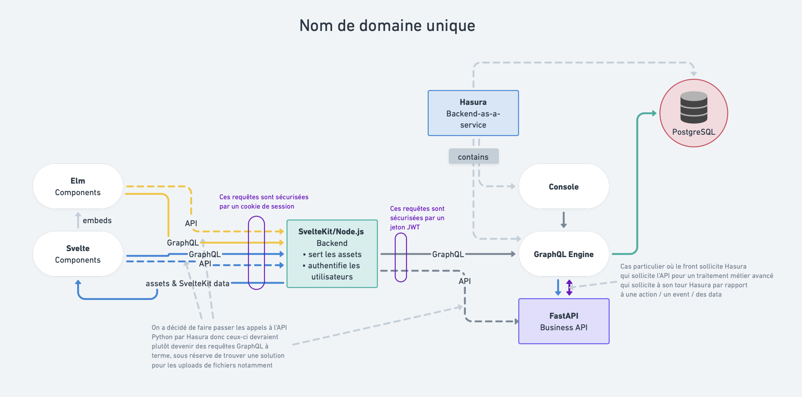

# Centraliser les requêtes HTTP(S) de Carnet de Bord sur un seul domaine

## :memo: État

Accepté

## :stethoscope: Contexte

L'architecture actuelle de Carnet de Bord consiste en trois services distincts :
 - une application SvelteKit, elle-même composée d'une partie _front_ (incluant des composants Elm) exécutée dans le navigateur Web et d'une partie _back_ en Node.js ;
 - un serveur GraphQL Hasura ;
 - un serveur Python (FastAPI).

Actuellement le code client exécuté dans le navigateur Web déclenche des requêtes HTTP(S) à chacun des services ci-dessus, qui sont chacun exposé sur un nom de domaine différent. Par exemple, en production, respectivement :
 - https://carnetdebord.inclusion.beta.gouv.fr ;
 - https://hasura.carnetdebord.inclusion.beta.gouv.fr ;
 - https://backend.carnetdebord.inclusion.beta.gouv.fr .

Noter qu'il a précédemment été [décidé](./20230331.recentrer-l-archi-sur-hasura.md) de faire passer un maximum de requêtes à l'API Python par le serveur Hasura, mais cela n'est pas encore totalement effectif et il reste la possibilité que certaines requêtes (notamment celles impliquant des envois de fichiers) ne puissent pas passer par Hasura.

Le fait que le client se connecte à trois noms de domaine différents introduit de la complexité, notamment :
 - pour le déploiement : pour chaque instance de l'application il faut exposer trois services distincts sur Internet, ce qui implique entre autres d'allouer trois noms de domaine et de configurer le client pour s'y connecter ;
 - le fait que nombre des requêtes soient _cross-origin_ (i.e. ciblant un autre nom de domaine que celui qui a servi le client Web) impose d'autoriser explicitement le navigateur a exécuter ces requêtes via les en-têtes _CORS_ (`Access-Control-Allow-Origin`, etc.) ;
 - pour l'authentification des requêtes : chacun des trois services doit pouvoir authentifier l'utilisateur indépendamment. Actuellement ceci est réalisé par l'utilisation d'un jeton JWT émis par le _back_ de l'application SvelteKit. Mais comme cela a été relevé dans le dernier audit de sécurité, une gestion simpliste de ce jeton nous force actuellement à lui donner une durée de validité trop importante, comptée en jours au lieu des minutes généralement recommandées pour ce type de jeton.

## :bulb: Proposition de solution

On propose de faire passer toutes les requêtes par un seul nom de domaine. Concrètement, les requêtes GraphQL seraient adressées à `https://carnetdebord.inclusion.beta.gouv.fr` au lieu de `https://hasura.carnetdebord.inclusion.beta.gouv.fr/v1/graphql` ; les requêtes à l'API Python seraient adressées à `https://carnetdebord.inclusion.beta.gouv.fr/v1/…` au lieu de `https://backend.carnetdebord.inclusion.beta.gouv.fr/v1/…`.

Les avantages de cette solution :
 - un seul service (le backend SvelteKit/Node.JS) a besoin d'être exposé sur Internet. Compte-tenu des contraintes de l'hébergement choisi (Scalingo), les autres services seront quand même exposés mais leurs URL n'auront pas besoin d'être publiées et pourront être facilement sécurisés avec un mécanisme n'autorisant que les requêtes en provenance du backend Node.JS. De plus, cela nous ouvre l'option d'héberger tous les services (Node.JS + Python + Hasura) sur un seul conteneur, pour par exemple alléger l'infrastructure des _review apps_ ;
 - toutes les requêtes utilisant le même nom de domaine, il n'y a plus besoin de configuration _CORS_ ;
 - les requêtes peuvent être sécurisées de manière transparente par un cookie de session, ce qui permet d'éviter toute manipulation du jeton d'authentification par le client JavaScript.

Les inconvénients de cette solution :
 - une charge supplémentaire est imposée au backend Node.JS, qui doit transmettre toutes les requêtes. Dans la mesure où ce serveur ne devrait faire que le transport des requêtes, sans inspecter leur _payload_, on s'attend à une charge limitée. On prendra soin de traiter les données en _streaming_ quand c'est possible pour éviter de charger la mémoire du serveur.
 - l'utilisation d'un cookie introduit le risque de _Cross-Site Request Forgery_, i.e. une attaque où ce cookie serait automatiquement joint à une requête au backend CdB déclenchée par un site tiers malveillant. Les contre-mesures à ce type d'attaque sont bien connues : cookie `HttpOnly`, `Secure`, `SameSite=strict` et seront mises en œuvre.

Voici à quoi ressemblerait l'architecture cible :

## :sparkles: Décision

Nous décidons de mettre en œuvre cette architecture. Dans un premier temps, le routage des requêtes sera effectué par des _endpoints_ serveurs intégrés dans l'application SvelteKit ; il faut noter cependant que ceci ne crée pas d'adhérence particulière à SvelteKit, qui reste destiné à être retiré du projet quand la [migration Elm](./20221004.choix-de-elm.md) sera effective. À ce moment-là il devrait être facile de remplacer le serveur SvelteKit par un serveur Node.JS plus basique dans lequel le code de routage des requêtes pourra être intégré.
